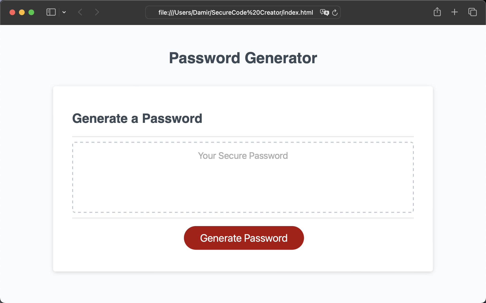
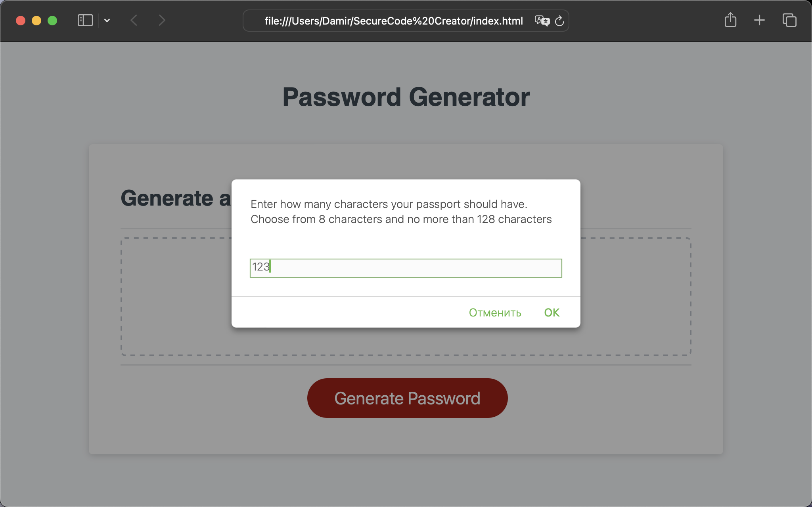
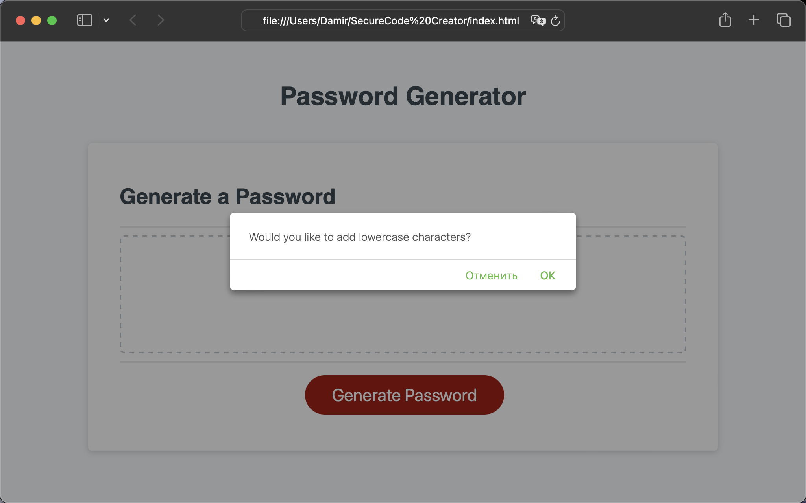
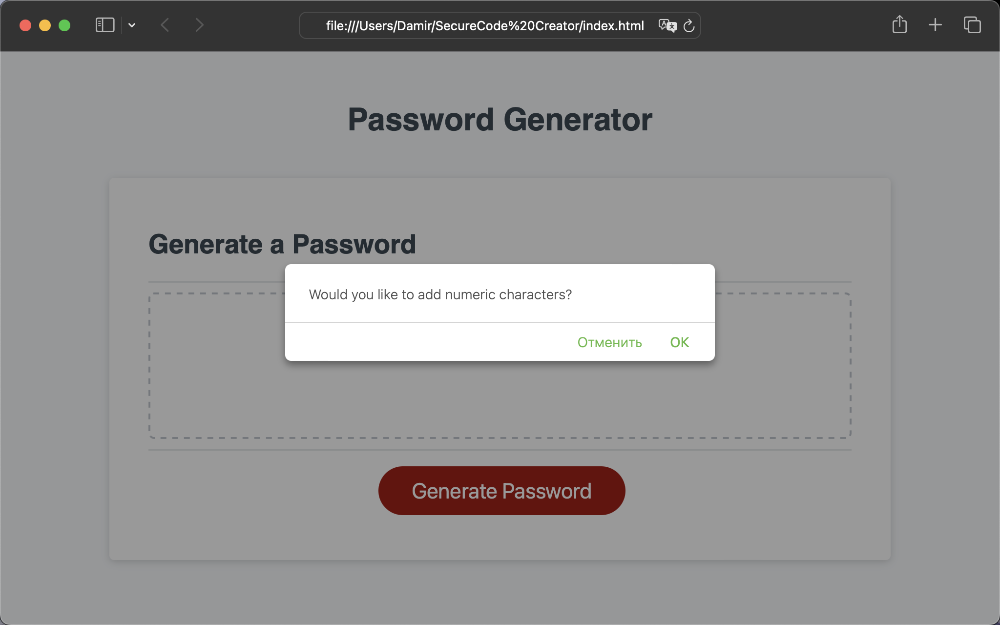
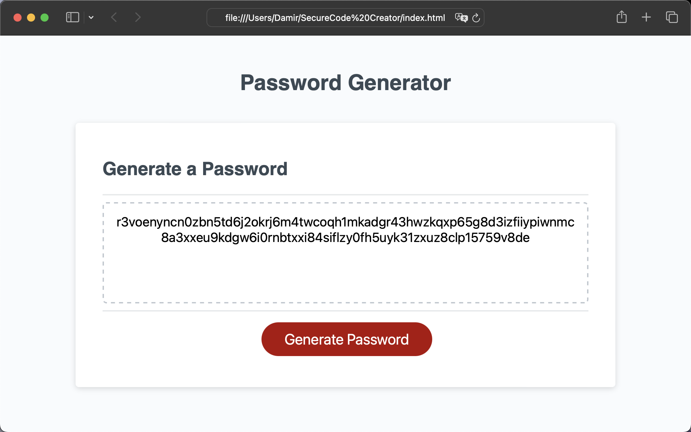

# Welcome to SecureCode-Creator 🔐

SecureCode-Creator is an web application that you can use to generate a random password based on criteria you've selected 

## Description

This application can run in the you browser, and will  dynamically generate a random password. It is based on HTML and CSS powered by JavaScript. By the way It have a clean and polished user interface that is responsive, ensuring that it adapts to multiple screen sizes.

You can choose the length of the password. It should be at least 8 characters and no more than 128 characters. Also you can confirm whether or not to include lowercase, uppercase, numeric, and/or special characters.

## Link of deployed application.

- https://damirfm.github.io/SecureCode-Creator/

## Screenshots of application

### Welcome screen

### Picking the length of password

### Picking the type of characters

### Picking the type of characters

### Generated password

## Installation

N/A

## Usage

To see the this codebase, you can review the updated HTML and CSS files here or clone this repo into your workstation. For your convenience, you can also check the ISSUES of this project. There you will see a list of topics that have been changed.

## Credits

For doing this job I used this helpful resources: 

- https://coding-boot-camp.github.io/full-stack/github/professional-readme-guide
- https://developer.mozilla.org/en-US/docs/Web/API/Window/confirm
- https://developer.mozilla.org/en-US/docs/Web/API/Window/prompt
- https://developer.mozilla.org/en-US/docs/Web/JavaScript/Reference/Global_Objects/String/concat
- https://developer.mozilla.org/en-US/docs/Web/JavaScript/Reference/Statements/for

## License

MIT License

## Badges

    

  

  